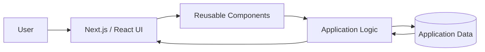

# SkillSync

> A web application for connecting skills, interests, and academic collaboration.

[](https://nextjs.org/)
[](https://www.typescriptlang.org/)
[](https://tailwindcss.com/)
[](https://vercel.com/)

## Overview

**SkillSync** is a web-based platform designed around academic and project collaboration.

The idea is simple: students often have skills they can contribute, but finding the right project, teammate, or mentor can be difficult. SkillSync brings these pieces together through a single interface where users can represent their skills and interests and discover relevant collaboration opportunities.

The project is built with **Next.js, React, TypeScript, and Tailwind CSS**, with the application structured around reusable components and a modern web development workflow.

## Why SkillSync?

Academic projects often involve two separate problems:

* finding people with complementary skills
* finding project ideas that actually fit those skills

SkillSync explores how these problems can be brought into the same platform instead of treating project discovery and collaboration as separate tasks.

```text
User Profile
     │
     ├── Skills
     ├── Interests
     └── Academic Context
             │
             ▼
      ┌───────────────┐
      │   SkillSync   │
      └───────────────┘
             │
       ┌─────┼─────┐
       ▼     ▼     ▼
   Projects Mentors Teammates
```

## Core Areas

### Skill & Profile Discovery

Users can represent their technical interests and skills so that the platform can work with structured profile information.

### Project Discovery

The platform is designed around connecting a user's profile with relevant academic project opportunities.

### Collaboration

SkillSync brings together the idea of finding a project and finding people who can contribute to it.

### Modern Web Interface

The frontend uses a component-based architecture with Next.js and TypeScript, with Tailwind CSS handling the interface styling.

---

## Application Architecture



The application is organized around a frontend-first architecture, keeping the interface, reusable components, and application logic separated rather than placing everything inside individual pages.

---

## Tech Stack

| Layer           | Technology   |
| --------------- | ------------ |
| Framework       | Next.js      |
| Language        | TypeScript   |
| UI              | React        |
| Styling         | Tailwind CSS |
| Build           | Next.js      |
| Deployment      | Vercel       |
| Package Manager | npm          |

---

## Project Structure

```text
skill-sync/
├── docs/
├── src/
├── .idx/
├── .gitignore
├── apphosting.yaml
├── components.json
├── next.config.ts
├── package.json
├── package-lock.json
├── postcss.config.mjs
├── tailwind.config.ts
└── tsconfig.json
```

The main application code lives under `src/`, while project-level configuration files define the Next.js, TypeScript, Tailwind, and deployment setup.

---

## Getting Started

### 1. Clone the repository

```bash
git clone https://github.com/sowmyadasar1/skill-sync.git
cd skill-sync
```

### 2. Install dependencies

```bash
npm install
```

### 3. Start the development server

```bash
npm run dev
```

Open:

```text
http://localhost:3000
```

### 4. Create a production build

```bash
npm run build
```

---

## Live Demo

**[SkillSync](https://skill-sync-roan.vercel.app/)**

---

## What I Worked On

This project gave me an opportunity to work with a modern **Next.js + TypeScript** application structure while thinking about a real product problem rather than building an isolated UI.

Key areas include:

* structuring a Next.js application
* building reusable React components
* working with TypeScript
* designing user-facing workflows
* organizing application code for maintainability
* deploying a web application through Vercel

---

## Current Scope

SkillSync is an evolving project.

The current repository focuses on the web application and its underlying frontend structure. Additional collaboration, recommendation, authentication, and data-management functionality can be developed as the platform evolves.

---

## Future Improvements

* User authentication and profile management
* More detailed skill profiles
* Skill-based teammate matching
* Mentor discovery
* Project recommendation logic
* Improved project search and filtering
* Persistent user data
* Recommendation feedback and refinement
* More detailed project analytics

---

## Links

* **Live Demo:** https://skill-sync-roan.vercel.app/
* **GitHub:** https://github.com/sowmyadasar1/skill-sync

---

## Author

**Sowmya Dasari**

Computer Science graduate interested in **data analytics, machine learning, and software development**.

* GitHub: https://github.com/sowmyadasar1
* LinkedIn: https://linkedin.com/in/sowmyadasari1
